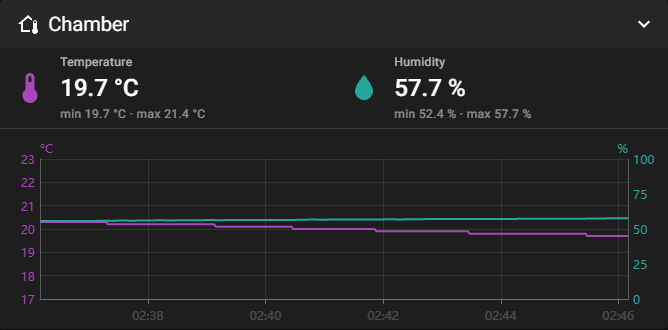

# Chamber DHT22 → Klipper / Mainsail

Temperatura e umidade da câmara (*chamber*) de uma impressora 3D com Klipper, medidas por um **DHT22 ligado num Orange Pi** e exibidas no **Mainsail** em um painel próprio, **Chamber**, com gráfico.

O sensor não fica na placa da impressora. Ele vai no Orange Pi, que já está ao lado da impressora, e o Klipper lê o valor pela rede como se o sensor fosse dele.



## Como funciona

```
DHT22 ──fio──► Orange Pi Zero 2W                         Ender 3 V3 KE (Klipper + Moonraker + Mainsail)
               ├─ kernel: driver dht11 (IIO)             ├─ módulo temperatura_remota.py
               │   /sys/bus/iio/devices/iio:device0      │   lê http://<pi>:8790/camara a cada 5 s
               └─ serviço "impressora" (Flask, :8790) ◄──┤   → temperature_sensor Chamber_Temp
                   GET /camara  → {temperatura, umidade} │   → temperature_sensor Chamber_Humidity
                                                         └─ Mainsail com o painel Chamber
```

1. **Orange Pi**: um *device tree overlay* liga o DHT22 ao driver `dht11` do kernel, que também lê o DHT22. O kernel faz a leitura com temporização precisa, sem bit-banging em Python.
2. **Serviço no Pi** (`orangepi/service`): lê o sensor a cada 10 s (com novas tentativas, porque o DHT às vezes falha uma leitura) e publica em `GET /camara`.
3. **Klipper** (`klipper/temperatura_remota.py`): um tipo de sensor novo para `temperature_sensor`. A requisição HTTP roda numa *thread* separada; o *reactor* do Klipper só lê o último valor, então rede lenta ou o Pi desligado nunca travam a impressora.
4. **Mainsail** (`mainsail/mainsail-chamber.patch`): painel **Chamber** com temperatura, umidade, mínimos e máximos, mais um gráfico com dois eixos (°C à esquerda, % à direita). Os sensores `Chamber_*` saem do painel Temperatures.

## Hardware

| Item | Detalhe |
|---|---|
| Impressora | Creality Ender 3 V3 KE com root (Klipper, Moonraker e Mainsail via Creality Helper Script) |
| Computador do sensor | Orange Pi Zero 2W (Allwinner H618), Armbian, kernel 6.18 |
| Sensor | DHT22 / AM2302 em plaquinha de 3 pinos |
| Resistor | Pull-up de 4,7 kΩ a 10 kΩ entre **VCC e DATA** (a maioria das plaquinhas já tem; um a mais em paralelo não atrapalha) |

### Ligações (header de 40 pinos do Orange Pi Zero 2W)

| DHT22 | Pino do Pi | Sinal |
|---|---|---|
| VCC (+) | **1** | 3.3V |
| DATA (S / OUT) | **7** | PI13 |
| GND (−) | **9** | GND |

> ⚠️ O pino 6 **não é GND** nesse modelo: é o PH0, o TX do console serial. Confira também a ordem impressa na plaquinha do sensor; nem toda placa segue VCC-DATA-GND.

## Instalação

### 1. Overlay no Orange Pi

```bash
sudo armbian-add-overlay orangepi/dht22-pi13.dts
sudo reboot
```

Depois do boot:

```bash
cat /sys/bus/iio/devices/iio:device0/in_temp_input              # 23300 = 23,3 °C
cat /sys/bus/iio/devices/iio:device0/in_humidityrelative_input  # 48000 = 48,0 %
```

**O detalhe que faz funcionar:** o overlay também define `input-debounce = <1 ...>` no controlador de GPIO. No padrão, o filtro de ruído das interrupções do Allwinner roda num relógio de 32 kHz (~31 µs). Isso engole os pulsos de 26–28 µs do DHT22, e o kernel registra `Only 22 signal edges detected` (uma leitura completa tem 84 bordas). Com o filtro no relógio de 24 MHz (1 µs), a leitura fecha.

### 2. Serviço no Orange Pi

```bash
cd orangepi/service
docker build -t impressora .
docker run -d --name impressora --restart unless-stopped -p 8790:8790 \
  -e MOONRAKER_URL=http://<ip-da-impressora>:7125 -e TZ=America/Sao_Paulo impressora
curl http://localhost:8790/camara
# {"ok":true,"temperatura":21.1,"umidade":53.3,...}
```

O container lê `/sys/bus/iio` do host sem privilégios extras. O mesmo serviço também tem a ponte com a Alexa (ver abaixo); sem configurá-la, ela simplesmente não é usada.

### 3. Klipper (na impressora)

```bash
scp klipper/temperatura_remota.py root@<impressora>:/usr/share/klipper/klippy/extras/
scp klipper/camara_pi.cfg        root@<impressora>:/usr/data/printer_data/config/
```

No `printer.cfg`, junto dos outros `[include]`:

```ini
[include camara_pi.cfg]
```

Os sensores (o parâmetro `valor` escolhe o que cada um lê):

```ini
[temperatura_remota]

[temperature_sensor Chamber_Temp]
sensor_type: temperatura_remota
url: http://<ip-do-pi>:8790/camara
valor: temperatura
min_temp: -10
max_temp: 100

[temperature_sensor Chamber_Humidity]
sensor_type: temperatura_remota
url: http://<ip-do-pi>:8790/camara
valor: umidade
min_temp: -10
max_temp: 100
```

> No `Chamber_Humidity`, o campo "temperature" do Klipper carrega a umidade em %. É assim que ela entra no histórico do Moonraker e no gráfico do Mainsail.

Reinicie o **serviço** do Klipper. O `RESTART` não recarrega módulos Python já importados:

```bash
/etc/init.d/S55klipper_service restart     # Creality OS; em outros sistemas: sudo systemctl restart klipper
```

### 4. Mainsail com o painel Chamber

O patch foi feito sobre o **Mainsail v2.17.0**:

```bash
git clone --depth 1 --branch v2.17.0 https://github.com/mainsail-crew/mainsail.git
cd mainsail
git apply ../mainsail/mainsail-chamber.patch
CYPRESS_INSTALL_BINARY=0 npm ci
npx vite build
rm dist/config.json        # mantém o config.json que já está na impressora
```

Na impressora, guarde o original e troque:

```bash
cd /usr/data
cp -a mainsail mainsail-original
mkdir mainsail.new && tar xzf mainsail-chamber.tgz -C mainsail.new   # (o conteúdo de dist/)
cp mainsail/config.json mainsail.new/ && chmod -R a+rX mainsail.new
mv mainsail mainsail.old && mv mainsail.new mainsail
```

O que o patch muda:

- `src/components/panels/ChamberPanel.vue`: o painel novo;
- `src/plugins/chamber.ts`: identifica os sensores `temperature_sensor Chamber_*` (o de umidade tem "humid" no nome);
- Temperatures (lista e gráfico): deixa de mostrar os sensores da câmara;
- registro do painel no dashboard (`variables.ts`, `gui/getters.ts`, `Dashboard.vue`, ícone e texto em `en.json`). O painel só aparece se existir algum sensor `Chamber_*`.

> Atualizar o Mainsail pelo Moonraker volta para a versão oficial e o painel some. Para manter, aplique o patch na versão nova e gere o build de novo.

## Alexa (opcional, em andamento)

O serviço do Pi tem um endpoint de *custom skill* (`POST /alexa`, com verificação de assinatura da Amazon) para comandos como:

- "Alexa, pede pra minha impressora **aquecer a mesa em 65 graus**" / "aquecer o bico em 210" / "pré-aquecer PLA";
- "qual a temperatura do bico", "qual a umidade da câmara", "**quanto tempo falta**";
- "**parar a impressão**", que pede confirmação antes de cancelar.

O modelo de voz (pt-BR) está em `alexa/modelo_alexa.json`. O endpoint precisa estar acessível em HTTPS (aqui, por um túnel Cloudflare só no caminho `/alexa`). Ponto em aberto: a Amazon recusou o certificado Let's Encrypt de cadeia nova (YE2 → Root YE); a correção prevista é trocar a autoridade do certificado do Cloudflare para Google Trust Services.

## Licença

[MIT](LICENSE)
